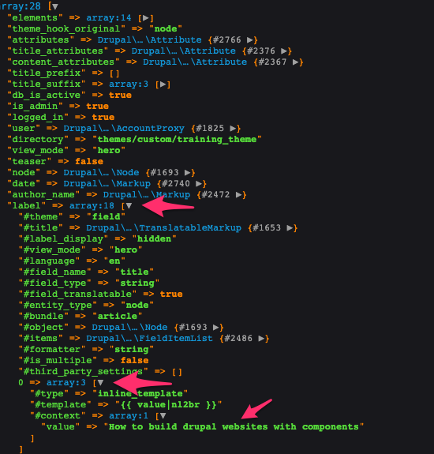

# Getting field values

Earlier we enabled twig debugging in order to identify the right template suggestions for our components. Twig debugging also means [discovering and inspecting twig variables](https://www.drupal.org/docs/8/theming/twig/discovering-and-inspecting-variables-in-twig-templates) available within the scope of the twig template we are working with.

In addition to enabling Twig debugging, we need the [devel module](https://www.drupal.org/project/devel) which provides tools to help us identify the right variables in our templates. One of these tools is **Kint**. Kint provides a nice user interface to print content arrays. This makes it easy for developers to see all available variables for the content currently being rendered on the page.

## Passing field values to components

Kint is a PHP Debugging tool. Kint for PHP is a tool designed to present your debugging data in the absolutely best way possible. In the Presenter template method you'll quickly discover that when passing the value of a field to your component, Drupal does not give us the raw value of that field, we're instead given a [render array](https://www.drupal.org/docs/8/api/render-api/render-arrays), and when that array is rendered, it includes a lot of default markup that will often get in the way. While we may be tempted to just pluck the value that we want from the render array and pass it to our component, it's best to try and let Drupal fully render the field to avoid cache invalidation issues.

## Exercise: Debugging Twig

1. Before you can debug Twig, you need to enable the **devel** module
2. In the twig template you wish to get variables for \(i.e. `node--article--hero.html.twig`\), type `{{ dpm() }}`
3. Clear Drupal's cache and reload the page
4. You should see the render output as shown below:

The example below shows us the value of the title field for the hero. Notice how some fields have a **\[** &gt; **\]** sign next to it. This means each field is an array you can drill down into until you get to its value. See example below:



In the example above we expanded `label` until we get to the `value` of it. This shows us the actual value entered in Drupal for this field \(_How to build drupal websites with components_\). So for us to get the right field value when integrating the components with Drupal we need to declare the full field structure as shown to us above. In this example it would be something like this:

```php
content.field_image.0['#context'].value
```

However, this is not necessarily best practice. Although using the format above to get the field's value will work, there are some issues related to Drupal cache validation that can arise from this approach. A better approach would be to use the [Twig Field Value](https://www.drupal.org/project/twig_field_value) or [Twig Tweak](https://www.drupal.org/project/twig_tweak) modules. Using one of these modules would allow us to format the field in such a way that caching validation is not compromised. Example:

```php
content.field_name|field_value
```

This will get us the same value but it will do it in a responsible way without breaking Drupal caching validation.


Further reading: [Ensuring Drupal 8 Block Cache Tags bubble up to the Page](https://www.previousnext.com.au/blog/ensuring-drupal-8-block-cache-tags-bubble-up-page).


