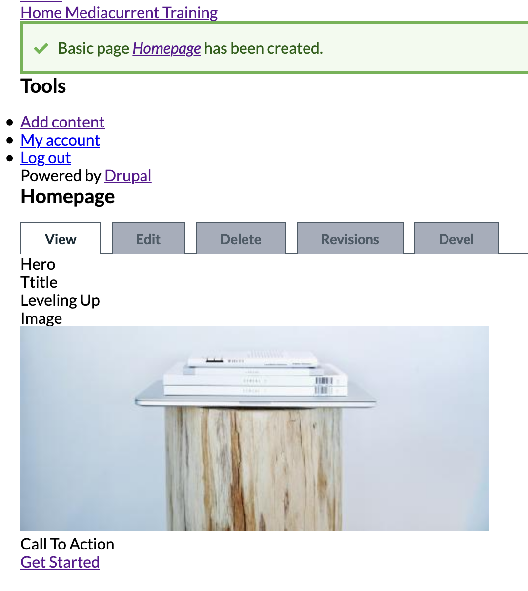

# Homepage content type

### Exercise: Building a Homepage content type

We'll build a new content type which we will use to build the homepage with all of its components shown in our design.

1. From Drupal's Admin Toolbar, click **Structure | Content Types**
2. Click the **Add content type **button
3. In the _name_ field type **Homepage**
4. Click the **Save and manage fields** button at the bottom of the page
5. Delete the **body **field

### Exercise: Adding the Hero field to the Homepage

1. While still in the Homepage content type, click the **Add field** button
2.  Under the _Add a new field_ dropdown, scroll to the **Reference** section and select **Content**

    | Label | Machine name |
    | ----- | ------------ |
    | Hero  | `field_hero` |
3. Click the **Save and continue** button
4. Change _Allowed number of values\__ to **Limited - 1**
5. In the _Reference Type_ section, choose **Article** under _Content type_
6. Click the **Save settings** button

### Exercise: Create a new Node with a Hero

Using the Homepage content type, create a new node and add a Hero component in it:

1. From Drupal's Admin toolbar, click **Content**
2. Click the **Add content** button
3. Select **Homepage**
4. As the Page title type** Homepage**
5. In the Hero field, begin typing any characters and as article suggestions begin to display, select an article of your choice
6. Click the **Save **button

The above exercise will create a node of type Homepage, with an article as the Hero.  It is clear we have more work to do since the Hero article does not look like a Hero at all.  We will clean things up in the following exercises.\

It's pretty obvious there are a lot of things that need improvement with our Hero, but we will get to that shortly.  
