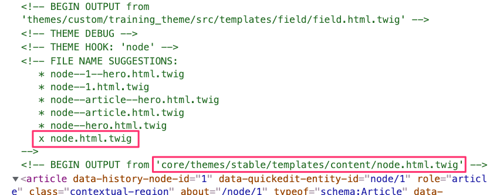
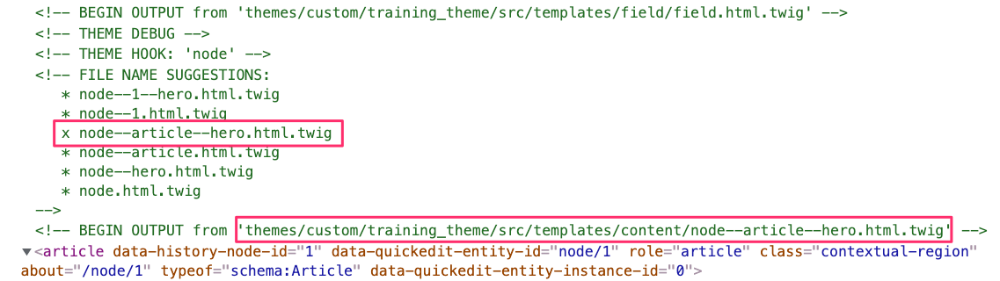

# Twig template suggestions

[Template suggestions](https://www.drupal.org/docs/8/theming/twig/working-with-twig-templates) are Twig templates used to override Drupal core or contrib modules templates. Template suggestions are saved in your theme's `/templates` directory. This is where Drupal knows to look for twig templates when rendering content. If it finds twig templates it uses those over the ones in core when rendering content.  Template suggestions are what we will use to integrate components with Drupal.  These template suggestions in the context of component integration, are typically referred to as **Presenter Templates** and as you will see, their only purpose is to pass data from Drupal to the component.  They act as the middleman between Drupal and Pattern Lab components.

### Identifying template suggestions

If you have been using Drupal for a while you may be well familiar with where to get templates from or what to name them. However if you've never worked with template suggestion no worries, Twig debugging, which [you should have enabled](https://www.drupal.org/node/2598914) in the previous page, will help us identify the templates we need.

### Examples of Twig template suggestions

Template suggestions can be generic or extremely specific depending on the task at hand.  Below are two examples of naming conventions for template suggestions; one for **Node types** and the other for **Paragraph types**.



```
node--[nodeid]--[viewmode].html.twig
node--[nodeid].html.twig
node--[content-type]--[viewmode].html.twig
node--[content-type].html.twig
node--[viewmode].html.twig
node.html.twig
```





```
paragraph--[paragraph-type]--[viewmode].html.twig
paragraph--[paragraph-type].html.twig
paragraph--[viewmode].html.twig
paragraph.html.twig
```



### Exercise:  Debugging the Hero 

* In your Drupal site, visit the page you created before with the Hero
* Right-click anywhere on the hero and select **Inspect  **or** inspect element**, depending on your browser.  This will display the HTML that makes up the page you are currently viewing.  In addition, it will display other information generated by Twig debugging.  See an example of Twig debug output below (click on it to zoom in):



If you look at the image above, you will see a few things that are extremely helpful for creating the right template suggestions:

* The last line of green text (`BEGIN OUTPUT...`) shows where the template being used by Drupal to render the Hero is located and what its name is (`core/themes/stable/templates/content/node.html.twig`).
* Just above that line, under **FILE NAME SUGGESTIONS**:, there is a list of files all of which begin with **node**. Since we are using a Drupal node (Article), for the hero, Drupal is telling us we can create a Twig template with any of the names listed above and we can customize it to our needs.  This list is what we mean when we say _Template suggestions_.
* The file with an **"X"** next to it is the template Drupal is currently using to render the Hero.

### Exercise: Creating new template suggestions


**IMPORTANT: **The first rule of Drupal is "**Don't hack core**".  This means you should never modify a template provided by Drupal core, or a contrib module.  Instead, you create a copy of that template in your theme.  This is a best practice and we are going to follow it throughout this training.


1.  Copy`node.html.twig` from `core/themes/stable/templates/content/`

    into your project's `/themes/custom/training_theme/src/templates/content/` .  Feel free to create the **content** folder inside _templates _if it does not exist.   You can use the command line or Mac's Finder/ Window's Explorer to copy this file.
2. Rename the newly copied template in your theme to `node--article--hero.html.twig`.  Why this name?  Well, while we could have used any of the suggested names above, `node--article--hero*` is specific enough so that any changes we make to the template will only affect the Hero content and not other content.  Now every time the Hero component is rendered, Drupal will use this new template and not the one provided by Drupal core.
3. Next clear Drupal's cache (**Configuration > Development > Performance**)
4. Reload the page and inspect the code one more time (Right-click on Hero and select **Inspect**).



Notice there is an **"X"** next to `node--article--hero.html.twig`, which means Drupal is now using our custom twig template suggestion. In addition, notice the path of the template is now our own theme's template directory.


**TIP**: If I know I will be creating multiple template suggestions of the same kind (i.e. node), I would normally leave the unchanged copy of `paragraph.html.twig` in my theme and make copies of it every time I need a new template. This way I don't have to copy the same template over and over from Drupal core or a contrib module (I'm lazy).

