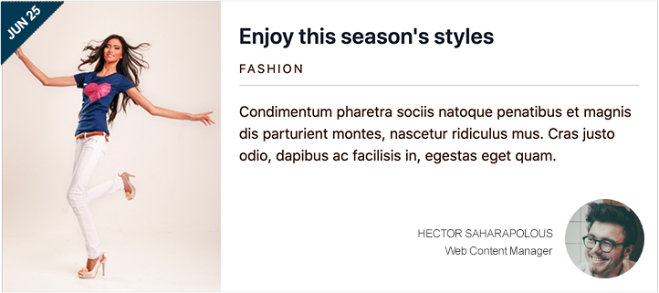

# Card Variant

Probably the first thing you should look at to determine if a component is a candidate for variants, is the data fields, and second, the component's markup.

Visually we know the two different variants look similar, however, if we pay close attention we will notice that the data fields between the variants are different. In this particular case although some of the fields may be different, I feel we have enough of shared attributes between the variants that we should have no problem going the variant route vs. new components. Let's start! The new variant will be called **Card wide**.

## Creating the Card variant



We can see that the overall layout of the "Card wide" lends itself nicely to a variant. However, we see that some of the fields found in the original card are not present here \(tags\), and, there is also a new field in this variant that is not part of the original card \(button\).

Before we can create a new variant, we need to make some updates to the original Card component so it is easier to adapt it to new variants.

### Modifier class

A CSS modifier class is a pretty common way to make changes to any element. For example, let's say we use two types of buttons in our website; one red and one blue. Using CSS classes like say, `button--blue`, and `button--red` will allow us to change their colors without altering the original button. We will use a similar approach to achieve some of the changes in the Card wide variant.

* Notice that **card.json** already has a key for `modifier`.  This will allows us to pass a value to card.twig so we can implement some of the changes on the card wide variant.



```yaml
{
  "modifier": "",
}
```



* If you look at card.twig, notice we have a placeholder for modifier:



```php
<article class="card{{ modifier ? ' ' ~ modifier }}......">
```



The part `{{ modifier ? ' ' ~ modifier }}` is a Twig conditional statement asking "_Is there a value for modifier in JSON?_" if so, print it here along with the class of `card`, but first add an empty space in between the two classes ``(` ` ~)``. For example, if the value for modifier in JSON is, `card--wide`, when the card is rendered in Pattern Lab, the `article` wrapper will look like this:



```php
<article class="card card--wide">
```



Now that we have the modifier key available, you can test it by adding any value to the `modifier` key and running `npm run watch` to view the card component in Pattern Lab. The Card component should now have, in addition to `card`, the value you added as an extra CSS class.

## CSS updates

In the interest of time, our CSS styles for the card already include styles for when we have a `card--wide` class in addition to `card`. So if you did use **card--wide** as the example value above, you should actually see the card looking different than the original card.

Our test above proves that using a CSS modifier class can help achieve some of the changes in the card variant, however, the goal is to not alter the original Card component when creating the variant. To accomplish this we need to work with Pattern Lab's Pseudo Patterns.

### Pseudo Patterns in Pattern Lab

Pattern Lab uses [Pseudo Patterns ](https://patternlab.io/docs/pattern-pseudo-patterns.html)to create variants of components. Pseudo-patterns are similar to [pattern-specific JSON files](https://patternlab.io/docs/data-pattern-specific.html) but are hinted in such a way that a developer can build a variant of an existing pattern. The idea of Pseudo Patterns is that Pattern Lab will create new instances of the source component, but it will not alter the source component. This is perfect because in the example of the card, we don't want to modify or change the way the original card component looks or behaves, when we create the **Card Wide** variant. The basic syntax for pseudo patterns is:

```text
patternName~pseudoPatternName.json
```

The tilde \(~\) and .json file extension are the hints that Pattern Lab uses to determine that this is a pseudo-pattern. The **patternName** tells Pattern Lab which existing pattern it should use when rendering the pseudo-pattern. The **pesudoPatternName** tells Pattern Lab the name for the new variant. The JSON file itself works exactly like the [pattern-specific JSON file](https://patternlab.io/docs/data-pattern-specific.html) . But it has the added benefit that the pseudo-pattern will also inherit any values from the existing pattern’s JSON file. This is not always a good thing and we will need to address this in our exercise.

From a navigation and naming perspective **patternName** and **pseudoPatternName** will be combined.

### Exercise: Creating a new variant

1. Inside the _card_ folder create a new JSON file with the following name: `card~wide.json` \(notice the tilde \(~\)  in the file name\). We don't need to create a new Twig file because by default Pattern Lab will use the original pattern's.twig template.  This also will need updating in order for us to achieve our card variant.  More on this later.
2. Copy all the code from `card.json` into `card~wide.json`

### Selecting the right fields for the card variant

As indicated above, by default the pseudo pattern file \(`card~wide.json`\), inherits all the fields from `card.json`. This is usually good but in our case, we don't need some of the fields in the Card variant. For example, we don't need the tags or the date fields. In addition, the card title in the variant should not be a link. And finally, the card variant uses a button but the original card does not. So how do we manage those fields without affecting the original Card component? Let's take a look:

* Update `card~wide.json` as shown below:



```yaml
{
  "image": "",
  "title": {
    "heading_level": "2",
    "modifier": "card__title",
    "title": "Level up your game",
    "url": "#"
  },
  "date": "Mar 16",
  "category": "Sports",
  "body_text": "Curabitur blandit tempus porttitor. Vestibulum id ligula porta felis euismod semper. Vivamus sagittis lacus vel augue laoreet rutrum faucibus dolor auctor.",
  "tags": "",
  "author": "<div class=\"author__photo\"></div><div class=\"author__name\"><span>Valentina Delgado</span><span>Digital Strategist</span></div>",
  "modifier": "card--wide"
}
```



* Let's start with the new fields.  As you can see we have added the **category** and **Author** fields.
* Next, for those fields we don't need in the card wide variant \(tags\), we are declaring them with no values.  If we simply remove them, they would be inherited from `card.json` It is best to leave them empty. They will not be printed on the page because in `card.twig` we first check if the field exists or it has content by using an `if` statement.  So any field that is empty above, will not be used.

### Twig blocks

Now that the variant's JSON is ready with only the fields we want, it's time to update **card.twig** to ensure the right card variant is rendered. Here is what we are going to do:

#### Date for card wide


**Code indentation:**  Be sure to properly indent your code.  The snippets below may not always match your current indentation settings.


* In your editor, open `card.twig` and at around line 7 \(your line numbers may vary\), we need to add a twig block for the date which in the Card wide variant is displayed on the top left corner of the card over a navy blue corner chip..  Add the following code snippet directly after the `{{ title_suffix }}` line:

```php

  <div class="card__featured--date">
    
      {{ date }}
    
  </div>

```

* First we are checking whether the value of the `modifier` variable is `card--wide`, or if the Drupal view mode we are using is `featured`.  This will ensure that only if one of this conditions is met we will be able to access this twig block.  
* The twig block name is `featured_date`.  However this name can be anything that makes sense to you.
* Inside the twig block we are printing the date variable.
* Finally we close the twig block and the if statement.  The name of the twig block in the `endblock` statement is optional.  For example, the following should also work: ``.  However, we expect a few twig blocks on this template so adding each of the block's names at the end makes it clear where blocks start and end.

#### Regular card date

* Next, we need to repeat the process above for printing the date on the non-wide card.  Having twig blocks for each date on each card variant will help us be more explicit about where we want to print each of the dates based on the card type we are working with.  Modify the existing date field to look like this:

```php

  <div class="eyebrow card__date">
    
      {{ date }}
    
  </div>

```

* The conditional statement above is checking that the view\_mode's value is not `featured`.  If so, it will print the date directly under the card's title.
* Again, using a twig block gives us the ability to modify this field before Drupal prints it.

#### Category field

* For the category field we don't need to perform any type of conditional since it will only be displayed in the card wide variant.  This means we can hide it from the regular card view mode \(teaser\).  Modify the category field as shown below:

```php

  
    <div class="eyebrow card__category">
      {{ category }}
    </div>
  

```

* Notice that both, the date and category fields use the same CSS class of `eyebrow`.  This will allow us to style both fields identically.


If you are wondering why are we placing the code snippets in those very locations within the file, the simple answer is that that's where those fields appear in the card. 


#### Card tags

* Just like the category field above, the tags are only used in the regular card variant and not the card wide variant.  So we will just wrap it in a twig block to be sure.  Update the tag's code as follows:



```php

  
    
  

```



#### Author

* Finally, we are going to add directly after the ending of the tags field, the author info.  Since this only displays in the card wide variant, we can also control its display through the view mode settings.  We'll do this shortly.  Add the following code just below the tags field:



```php

  
    
  

```



#### Full card

* The full card code should look like this:



```php
{{ attach_library('training_theme/card') }}

<article class="card{{ modifier ? ' ' ~ modifier }}{{- attributes ? ' ' ~ attributes.class -}}"
  {{- attributes ? attributes|without(class) -}}>
  {{ title_prefix }}
  {{ title_suffix }}
  {# Date for featured content cards. #}
  
    <div class="card__featured--date">
      
        {{ date }}
      
    </div>
  
  
    <div class="card__media">
      {{ image }}
    </div>
  
  <div class="card__content">
    
      
    
    
      <div class="eyebrow card__date">
        
          {{ date }}
        
      </div>
    
    
      
        <div class="eyebrow card__category">
          {{ category }}
        </div>
      
    
    
      <div class="card__body">
        {{ body_text }}
      </div>
    
    
      
        
      
    
    
      
        
      
    
  </div>
</article>

```



* Now if we save our changes, we should see the two card variants in Pattern Lab, one with tags and a date field under its title, and the other one without tags, with date on top left corner of the card.  In addition, the card wide variant should display the author's headshot, name and title. 

If you don't have Pattern Lab running, run this command:

```php
npm run watch
```

