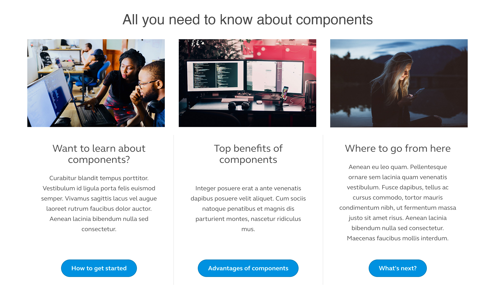

# Card Component

A component that will introduce us to a few more useful techniques for working with components is the image you see below. The image shows a typical type of content that you will most likely find on most websites. We will refer to this as **Latest Posts**, but this could be called many other things \(Card grid, article collection, latest news, etc.\). Whatever the name is, the point is that we have a component repeated multiple times. Some may build this a single component and there is nothing wrong with that approach, however, we could probably get more out of building a single card component first, then repeating it as many times as we want to. By doing this, we have an individual card component we could use not only for this type of content by for various types of content.

## Planning for an individual Card component

Before we can build the Latest Post component, we need to build a single **Card** component. This is a way to build reusable components and follows the principles of Atomic Design.

If you look at the image above, a single Card has the following data fields:

* image
* title
* body
* & button

## Your assignment

* Following the same steps for building the Hero or Quote components, build a Card component which reflects one of the items in the image above.
* After the Card component has been build in Pattern Lab, build a paragraph type for it the same way we did with the Hero and Quote components.

