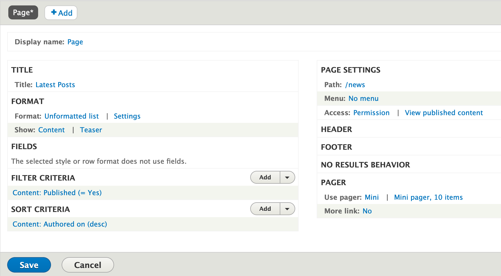

# Drupal Views & View Modes

To build the latest post section we are going to use the power of Drupal's views and View Modes.  By querying all Blog content we can generate a list of blog posts, then using View Modes, we can determine the fields we'll expose as well as the format in which fields will be rendered.

### Exercise: Featured Content View

Let's start by creating a new view to pull all blog posts we wish to display.  Drupal Views are database queries you can execute using Drupal's UI.

1. From Drupal's Admin toolbar click **Structure \| Views**
2. Click the **Add view** button
3. For View name type **Featured Content**
4. Machine name should auto complete to `latest_posts`
5. For VIEW SETTINGS, **Show** _Content_ **Of type:** _Blog_
6. Check **Create a page** __under PAGE SETTINGS
7. Update **Page title** and **Path** however you wish, or leave the defaults
8. Under PAGE DISPLAY SETTINGS set the **Display format:** _Unformulated list_ **of** _Teasers_
9. Click the **Save and edit** button
10. Click the **Save** button. The view should look similar the image below:

* The page we created above will serve as the destination page for the Featured Content content.  In my example above i set the page's path to **news**.  This means the page will be available at `http://<drupal-url>/news`
* Notice we used **Content \| Teaser** under FORMAT.  When creating Drupal Views we can choose from a series of formats for displaying content \(Table, HTML List, Unformatted list, Fields, and Content\).  Other formats can be added by contrib modules.  By choosing Content we can select a View Mode to manage the fields we want to display.  More on View Modes shortly
* The rest of the settings are self explanatory
* If you scroll down in the view you shoould see a preview of the content you are querying.  This is a great way to determine if you are pulling the right content.  If you edit the view you can make changes as needed.

### View Modes

View modes in Drupal are a great ways to display content in different ways.  The same type of content can be displayed differently in different pages by managing the fields to show.  Most entities in Drupal \(node, views, blocks, paragraph types, media, etc.\), support view modes.  In the example of our blog posts, we can show the post's image very large when viewing the post in its full view mode, but show it as a thumbnail when viewing the post in a card as part of the Featured Content view.  We will make these configurations shortly.

### Why View Modes?

By default Drupal provides some view modes out of the box.  For example, for Content Types, we can use the Default, Full and Teaser view modes.  By using view modes we let Drupal add all the logic for how to show/hide your content fields.

A typical view mode to display a minimal version of your nodes is the **Teaser** view mode. This is perfect to only show the fields we want using the Card component.

