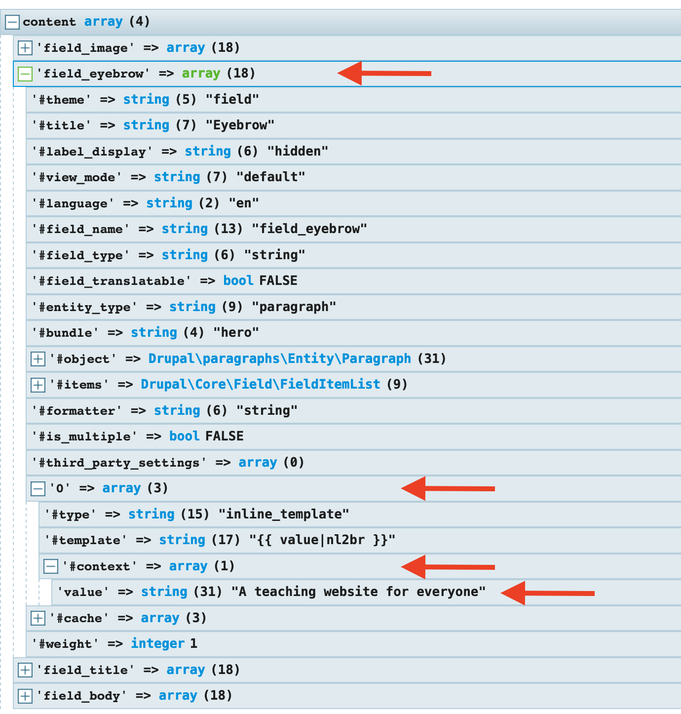

# Getting Twig variables

Earlier we covered how to enable twig debugging in order to identify the right template suggestions for our components.  Twig debugging also means [discovering and inspecting twig variables](https://www.drupal.org/docs/8/theming/twig/discovering-and-inspecting-variables-in-twig-templates) available within the scope of the twig template we are working with.

In addition to enabling Twig debugging, we need the [devel module](https://www.drupal.org/project/devel) which provides tools to help us identify the right variables in our templates.  One of these tools is **Kint**.  Kint provides a nice user interface to print content arrays.  This makes it easy for developers to see all available variables for the content currently being rendered on the page.

### Debugging with Kint

Kint is a PHP Debugging tool.  Kint for PHP is a tool designed to present your debugging data in the absolutely best way possible. So let's say you have some data in Drupal and you need to get more data out of it, but you don’t know how the data is structured until you poke around inside it.

### Using Kint

* Before you can use Kint, you need to enable the **devel** and **devel\_kint** modules \(both part of the devel module\)
* In the twig template you wish to get variables for \(i.e. `paragraph--hero.html.twig`\), type `{{ kint(content) }}`
* Clear Drupal's cache and reload the page
* You should see output like the one below:



**WARNING**:  By default kint will try to print all available variables on a page unless otherwise specified.  This could slow your site down drastically and even crash it.  The fix for this is to limit the number of levels in a render array that can be available.  [Follow these instructions](https://gist.github.com/JPustkuchen/a5f1eaeb7058856b7ef087b028ffdfeb) to enable this fix.


The example above shows us the fields or variables available in the `content` array.  Notice how each field has a **\[** **+ \]** sign next to it.  This means you can drill down each field until you get to the value of the field.  See example below:


**TIP**: To extend an array **DO NOT** click the **\[+\]** in the array, instead click the the bar/row away from the **\[+\]**.  For some reason Kint crashes if the **\[+\]** is clicked on.




In the example above we expanded `field_eyebrow` until we get to the `value` property of it.  This shows us the actual value entered in Drupal for this field \(_A teaching website for everyone_\).  So for us to get the right field value when integrating the components with Drupal we need to declare the full field structure as shown to us by Kint.  In this example it would be 

```php
content.field_eyebrow.0['#context'].value
```

However, this is not necessarily best practice.  Although using the format above to get the field's value will work, there are some issues related to Drupal caching that can arise from this approach.  A better approach would be to use the [Twig Field Value](https://www.drupal.org/project/twig_field_value) module.  Using this module would allow us to type

```php
content.field_eyebrow|field_value
```

This will get us the same value but it will do it in a responsible way without breaking Drupal caching.


Further reading:  [Ensuring Drupal 8 Block Cache Tags bubble up to the Page](https://www.previousnext.com.au/blog/ensuring-drupal-8-block-cache-tags-bubble-up-page).


