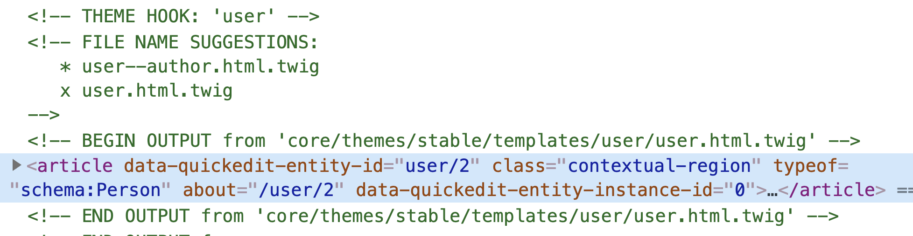

# Author

Users in Drupal are another type of entity.  This means we can theme them by using twig template suggestions.  We'll start by adding a couple of fields that by default User profiles don't have.  Then we will add a new view mode for users which will help us create the right template suggestion.

### Add new fields to the User profile  

As we just saw in the Card Wide variant, we are displaying the article's author information.  By default Drupal does not have a full name or title fields as part of user's profiles.  Let's add these fields so we can use them in our cards.

1. From Drupal's admin toolbar, select **Configuration &gt; People &gt; Account Settings**
2. Click **Manage fields**
3. Click **Add field**
4. Add the following fields and their properties

| Label | Machine name | Field type | Allowed number of values |
| :--- | :--- | :--- | :--- |
| Full name | `field_full_name` | Text\(plain\) | 1 |
| Title | `field_title` | Text\(plain\) | 1 |

### New User view mode

We'll create a new view mode to control which user's fields we can display.

1. While still within the People Account Settings screen, click **Manage Display**
2. Under the **Default** view mode, expand the **CUSTOM DISPLAY SETTINGS** fieldset
3. Click **Manage view modes**
4. Scroll down to the **Users** section and click **Add new User view mode** link
5. Type **Author** as the view mode name and click the **Save** button
6. Repeat steps 1 & 2 from _Add new fields to the User Profile ****_section at the top of the page
7. Expand the **CUSTOM DISPLAY SETTINGS** fieldset
8. Check **Author** and click the **Save** button

### Customize Author view mode

1. From the list of view modes now available \(Default, Author, and Compact\), click **Author**
2. Drag the **Member for** field into the **Disabled** section
3. For the remaining fields, hide their labels by selecting **Hidden** in the Label's dropdowns
4. Click the **Save** button

### Remove the link from the User's image

1. While still in the People Account Settings screen, click the gear icon to the right of the Image field
2. Change the **Link image to** dropdown to **Nothing**
3. Click the **Update** button
4. Click the **Save** button

### Update the blog content type to use the Author view mode

1. Go to Blog content type's manage display screen \(**Structure &gt; Content types &gt; Blog &gt; Manage display**\)
2. Click the **Featured** view mode
3. For the Author field, ensure **Rendered entity** is set as the format
4. Click the little gear icon to the right of the Author field
5. Change the view mode to **Author**
6. Click the **Update** then **Save** buttons

Changing the user's view mode to Author will help us create a new template suggestion for users.

### User's template suggestions

Out of the box Drupal does not provide template suggestions for users.  After researching a little I found a hook alter that will allow us to create new template suggestions.

1. In your editor, open `training_theme.theme` which is located in the root of your theme
2. Add the following code:



```php
/**
 * Implements hook_theme_suggestions_user_alter().
 *
 *   An array of alternate, more specific names for template files or theme
 *   functions for users.
 */
function training_theme_theme_suggestions_user_alter(&$suggestions, $vars, $hook) {

  // Define the view mode.
  $mode = $vars['elements']['#view_mode'];

  // Create a theme hook suggestion which has the view mode name in it.
  $suggestions[] = 'user__' . $mode;
}
```



* The hook alter above will make it possible for Drupal to provide some useful twig template suggestions.
* Clear Drupal's cache

1. Inspect the user by right-clicking over the user's picture and selecting **Inspect** or **Inspect Element**
2. As you scroll through the debugging info in your inspector you should be able to see template suggestions for users.  See screenshot:



* By default Drupal uses `user.html.twig` to render all users.  Thanks to the hook alter we added earlier we now see a new template suggestion, `user--author.html.twig`.  This template is using the new view mode we created for our users earlier.

1. Copy `user.html.twig` from the path shown in the image above \(`core/themes/stable/templates/user/`, into your theme's `/templates/user` folder
2. Rename the newly copied template `user--author.html.twig`
3. Clear Drupal's cache
4. If you reload the homepage again and inspect the user you should see our new template suggestion being used by Drupal.

### Integrating the Author component

1. Open `user--author.html.twig` in your editor and as we've done with all template suggestions, delete all the code except the comments
2. Add the following code and save the file



```php

```



* Reload Drupal's homepage and you should now see the author information properly themed.

