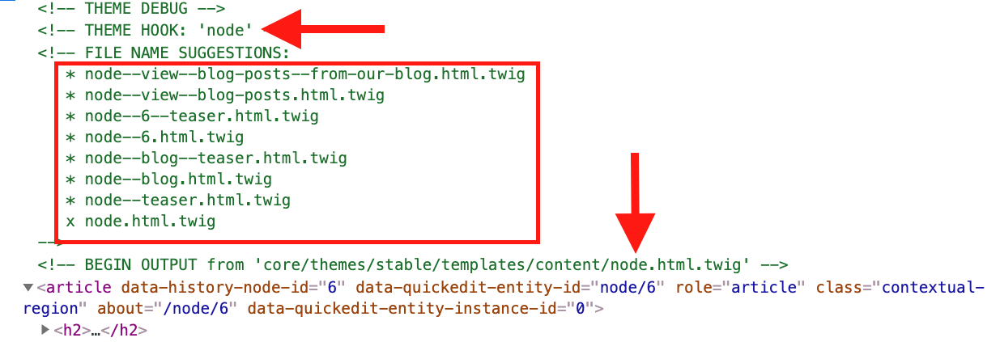
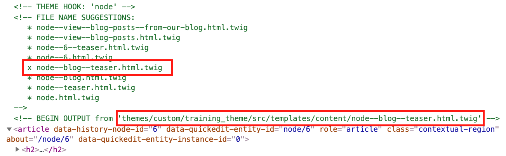

# Integrating the Card


Our homepage is displaying blog posts that meet the requirements of the Drupal View we created, but they lack styles. As we indicated before, each blog article will be represented by a Card component. Let's integrate the Card so our articles inherit all the attributes of the component.Let's recap the work we've done and what the next steps are:

1. We built the Card component (with the **Card Wide** variant)
2. Created a Blog content type with designated View Modes (**Full content, Featured, & Teaser**)
3. We created a Drupal View to generate the blog listing sections in our homepage
4. Finally, we created several blog posts to populate the homepage

#### Next steps:

We'll get back to the full view of a blog post later, for now we are going to focus on associating the Card component with the Teaser view mode, and the Card Wide variant with the Featured view mode. How do we do this? The answer is Twig template suggestions.

### Exercise: Creating twig templates for blog posts

1. In your Drupal site, navigate to the Homepage node
2. Right-click on any of the Blog posts articles within the _From our blog_ section, and select **Inspect** or **Inspect Element**
3. Scroll up in the inspector's code until you find the `<article>` element that wraps the entire article you clicked on.  There may be multiple `<article>` tags within each article, but ensure you are looking at the main article wrapper.  See screenshot below (click on it to zoom in):



* I've marked a couple of important items in the screenshot above to ensure you are looking at the correct section in the code.
* **THEME HOOK:** Tells you what entity you are currently looking at.  In this example we are looking at the **node**, which is what we want since we are trying to configure the Blog nodes with the right component.
* Next I have outlined all the possible template FILE NAME SUGGESTIONS Drupal is telling us we can use for this particular type of node.  We know we are looking at a node as all the template suggestion names start with the word **node--\***.  We can get as specific or general as we need to.
* Finally, I have pointed out where the current template being used (`node.html.twig`) is located.


**IMPORTANT:** To ensure we are all following along with the same article type, please ensure you selected an article from the _From our blog_ collection of articles. This means you should see the word `teaser` somewhere in the list of template names above. If you don't see it, close your code inspector and repeat steps 2 & 3 above with a different article.


#### Creating a template suggestion for Articles in teaser view mode

The focus at this point is to create template suggestions for all article nodes that will be displayed in the **Teaser** view mode. So if we look at the list of file name suggestions above we can ignore the top 4 names as those are either related to the full section of content or are extremely specific to only the single article we are looking at.

1. So based on the remaining names after ignoring the first 4, we can select the following name: `node--article--teaser.html.twig`. &#x20;
   1. **node** is the Drupal entity we are trying to integrate with
   2. **blog** is the content type (also an entity)This names is exactly what we need to style all blog nodes that will be displayed in teaser view mode.
2. Now that we've selected the template we need, let's create it by making a copy from `core/themes/stable/templates/content/node.html.twig` into your theme's templates directory (`/themes/custom/training_theme/src/templates/content/`
3. Rename the newly copied template as `node--article--teaser.html.twig`
4. Click your Drupal's cache


I know I will be creating other node related template suggestion so I will leave the copy of `node.html.twig` unchanged in my /templates folder so I can keep making copies of it.


If you reload the homepage, you shouldn't really notice much difference. However, if you right-click on the same article as you did before and select **Inspect** or **Inspect Element**, and scroll to the `<article>` element, you should see your new template being used by Drupal to render some of the blog nodes. See below for an example:



### Integrating the Card component

OK, now that our custom twig template is ready, it's time to plug it to our Card component so our blog posts start looking nice.

We'll break the integration process down so we can explain each part of it. You will find the full template at the bottom of this page.

1. Open **node--article--teaser.html.twig** in your editor and remove all the code except for the comments at the top of the template
2.  At the bottom of the template, add the following code:

    ```php
    
    ```

    First thing we are setting a twig variable to trigger a full render of the content variable
3.  Now let's create a twig variable for the card's title field

    ```php
    
    ```

    Why are we doing this? Well, Drupal gives us the article title text and url, but we still need to add a modifier class and a heading level. We are setting a variable so we can construct the title the same way we did when we built the heading component.
4.  Now, let's add an `embed` twig statement for the Card component:

    ```php
     
    ```

    Why use `embed` and not `include`? Twig gives us 3 ways to nest or "include" templates/components into other twig templates; `include`, `extends`, and `embed`. Each has their pros/cons. You can [learn more about them](https://github.com/fourkitchens/emulsify/wiki/When-to-use-include,-extends,-and-embed). We need to use `embed` instead of `include` to be able to use the twig blocks we added in the Card component for the `date` and `tags` fields
5.  Now let's start mapping the card's variables with Drupal fields and variables.

    ```php
    

    
    ```

    The first 3 items inside the `embed` statement above are Drupal specific variables so we leverage Drupal's use of `attributes`, `title_prefix` and `title suffix`. Adding these items will allows us to make use of Drupal's contextual links to quickly edit content as well as allowing Drupal to add its attributes to our component's markup.
6.  Let's now make use of the `article_title` variable we created above

    ```php
    

    
    ```

    * Next we are mapping the `image`, `date`, `body_text`, and `tags` variables with Drupal fields for those elements but first we check that the fields are not empty.
    * For the date format we are using a custom one so we can print the date in the right format.
7.  Time to add the twig blocks for date and tag fields.  Update your template as follows:

    ```php
    {% embed '@training_theme/card/card.twig' with
     {
       "attributes": attributes,
       "title_prefix": title_prefix,
       "title_suffix": title_suffix,
       "heading": article_title,
       "image": content.field_image|render|trim is not empty ? content.field_image,
       "date": node.createdtime|date('F j, Y'),
       "body_text": content.body|render|trim is not empty ? content.body,
       "tags": content.field_tags|render|trim is not empty ? content.field_tags,
       "modifier": ""
     } only
    %}

      
      

      
        {{ date }}
      

      
        {{ tags }}
      
    
    ```

    * Mapping each of the components with Drupal's equivalent fields is only half the job. At least for the date and tags fields in this case. By using Twig blocks we can explicitly declare the date we want to render in the cards.&#x20;
    * If you remember, we created two twig blocks for the date field. One for the regular card and one for the card wide. Twig blocks in the embed statement above let us pick which one the two we want to use while leaving the other one empty.
    * We start by declaring the `featured_date` twig block but we leave it empty.  This means Drupal will not output any content for that block.  Since the featured\_date is only used in the card wide, we don't need to render it in the regular card.
    * Next we declare the `card_date` twig block to print the date information.
    * Finally we declare the `tags` twig block to render the tags.

### Full integration code



```php
{# Sets variable to trigger content render array. #}


{#
Sets variable for article title to provide all
properties needed by the heading component (heading_level,
modifier, title, and url).
#}


{#
Uses embed to be able to include card component
and make use of twig blocks found in such component.
#}


  {#
  Removes content from featured_date twig block
  to avoid printing the date twice and in
  different places.
  #}
  
  

  {# Calls card_date twig block. #}
  
    {{ date }}
  

  {# Outputs tags. #}
  
    {{ tags }}
  

```



### Rendering blog nodes as cards in Drupal

Now that the card integration is complete, let's take a look at how the blog nodes look in Drupal.

1. After saving all your changes to **node--blog--teaser.html.twig**, clear Drupal's cache
2. Reload the homepage

### What's up with the Tags?

The card looks great but it looks like the tags are not styled at all.  We'll fix them next.
