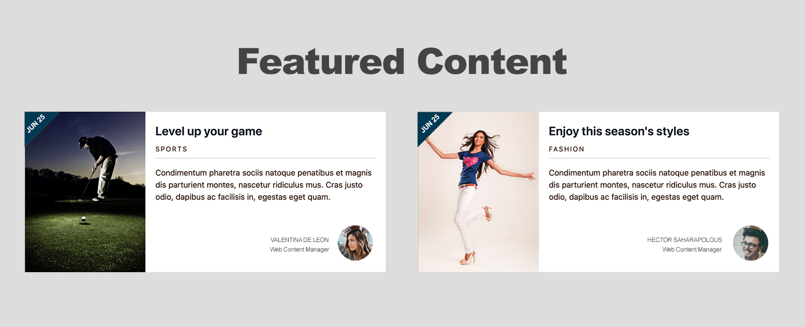

# Featured Content

## Featured Content



```php
{
  "heading": {
    "heading_level": "2",
    "modifier": "heading--large center section-header",
    "title": "Our Featured Content",
    "url": ""
  },
  "items": [
    {
      "image": "",
      "heading": {
        "heading_level": "3",
        "modifier": "card__title",
        "title": "The beauty of nature",
        "url": "#"
      },
      "date": "Jun 25",
      "category": "Sports",
      "body_text": "Curabitur blandit tempus porttitor. Vestibulum id ligula porta felis euismod semper. Vivamus sgittis lacus vel augue laoreet.",
      "author": {
        "photo": "",
        "name": "Valentina De Leon",
        "title": "Digital Strategist"
      },
      "modifier": "card--wide"
    },
    {
      "image": "",
      "heading": {
        "heading_level": "3",
        "modifier": "card__title",
        "title": "The beauty of nature",
        "url": "#"
      },
      "date": "Sep 27",
      "category": "Lifestyle",
      "body_text": "Curabitur blandit tempus porttitor. Vestibulum id ligula porta felis euismod semper. Vivamus sgittis lacus vel augue laoreet.",
      "author": {
        "photo": "",
        "name": "Valentina De Leon",
        "title": "Digital Strategist"
      },
      "modifier": "card--wide"
    }
  ]
}
```





```php
{{ attach_library('training_theme/featured-content') }}

<section class="featured-content{{ modifier ? ' ' ~ modifier }}{{- attributes ? attributes.class -}}"
  {{- attributes ? attributes|without(class) -}}>
  
    
  

  <div class="featured-content__items">
    
      
        
      
    
  </div>
</section>
```





```css
// Import site utilities
@import '../../global/utils/init';

.featured-content {
  @include component-spacing;
  background-color: $color-gray-light;
  padding: 40px 20px 0;

  @include breakpoint($bp-md) {
    padding-bottom: 100px;
  }
}

// On mobile cards are displayed
// vertically as a group.
.featured-content__items {
  align-items: center;
  display: flex;
  flex-direction: column;

  // On larger screens cards are displayed
  // horizontally as a group.
  @media screen and (min-width: $bp-lg) {
    flex-direction: row;
    justify-content: space-around;
  }

  .card {
    margin-bottom: 60px;

    @media screen and (min-width: $bp-xl) {
      flex: 0 0 45%;
      margin-bottom: 0;
    }
  }
}
```



## Featured Content List

So far we've been building individual components and built them in a way we can re-use them. Well, the time has come to build a list of content where we will re-use most components we've built. This is where component-based shines. By looking at the design comp below, we can see that we will be showing a collection of cards. In addition, the section has a title of "Featured Content" .



#### Exercise: Build the Featured Content component

Once the single Card component has been built, it is time to build the collection of Cards as shown in the image above.

This component will be completely different than the ones we've built thus far. All previous components have been a single item, this one will have an unlimited number of items. Let's start

**Component's stock content**

1. Inside `src/patterns/components`create a new folder called **featured-content**
2. Inside the _featured-content_ folder create a new file called `featured-content.json`
3. Inside _featured-content.json_ add the following code:



```yaml
{
  "heading": {
    "heading_level": "2",
    "modifier": "heading--large",
    "title": "Our Featured Content",
    "url": ""
  },
  "items": [
    {
      "image": "",
      "heading": {
        "heading_level": "3",
        "modifier": "featured-content__card",
        "title": "The beauty of nature",
        "url": "#"
      },
      "date": "March 16 2020",
      "body_text": "Curabitur blandit tempus porttitor. Vestibulum id ligula porta felis euismod semper. Vivamus sagittis lacus vel augue laoreet rutrum faucibus dolor auctor. Aenean lacinia bibendum nulla sed consectetur.",
      "tags": [
        {
          "text": "Phtography",
          "url": "#"
        },
        {
          "text": "Nature",
          "url": "#"
        },
        {
          "text": "Outdors",
          "url": "#"
        }
      ],
      "modifier": "featured-content__card"
    },
    {
      "image": "",
      "heading": {
        "heading_level": "3",
        "modifier": "featured-content__card",
        "title": "The beauty of nature",
        "url": "#"
      },
      "date": "March 16 2020",
      "body_text": "Curabitur blandit tempus porttitor. Vestibulum id ligula porta felis euismod semper. Vivamus sagittis lacus vel augue laoreet rutrum faucibus dolor auctor. Aenean lacinia bibendum nulla sed consectetur.",
      "tags": [
        {
          "text": "Phtography",
          "url": "#"
        },
        {
          "text": "Nature",
          "url": "#"
        },
        {
          "text": "Outdors",
          "url": "#"
        }
      ],
      "modifier": "featured-content__card"
    },
    {
      "image": "",
      "heading": {
        "heading_level": "3",
        "modifier": "featured-content__card",
        "title": "The beauty of nature",
        "url": "#"
      },
      "date": "March 16 2020",
      "body_text": "Curabitur blandit tempus porttitor. Vestibulum id ligula porta felis euismod semper. Vivamus sagittis lacus vel augue laoreet rutrum faucibus dolor auctor. Aenean lacinia bibendum nulla sed consectetur.",
      "tags": [
        {
          "text": "Phtography",
          "url": "#"
        },
        {
          "text": "Nature",
          "url": "#"
        },
        {
          "text": "Outdors",
          "url": "#"
        }
      ],
      "modifier": "featured-content__card"
    },
    {
      "image": "",
      "heading": {
        "heading_level": "3",
        "modifier": "featured-content__card",
        "title": "The beauty of nature",
        "url": "#"
      },
      "date": "March 16 2020",
      "body_text": "Curabitur blandit tempus porttitor. Vestibulum id ligula porta felis euismod semper. Vivamus sagittis lacus vel augue laoreet rutrum faucibus dolor auctor. Aenean lacinia bibendum nulla sed consectetur.",
      "tags": [
        {
          "text": "Phtography",
          "url": "#"
        },
        {
          "text": "Nature",
          "url": "#"
        },
        {
          "text": "Outdors",
          "url": "#"
        }
      ],
      "modifier": "featured-content__card"
    }
  ]
}
```



There is a lot going on in this file. Let's go over it and you will see that it's actually relatively straight forward.

* First we defined the `heading`  object which will be used as the title for the entire collection.
* At around line 8, we declared an `items` array.  This will help us mimic the array of content to build the collection.
* Each item in the items array represents a card.  Inside each card item we have defined the card's fields \(`image`, `title`, `body_text`, `cta` \).  We have repeated this 3 times to achieve the collection shown in the Featured Content image above.

**Component markup**

So the data is ready, let's go ahead and add the markup for the component.

1. Inside the _featured-content_ folder create a new file called `featured-content.twig`
2. Inside _featured-content.twig_ add the following code:



```php
{{ attach_library('training_theme/featured-content') }}

<section class="featured-content{{ modifier ? ' ' ~ modifier }}{{- attributes ? attributes.class -}}"
  {{- attributes ? attributes|without(class) -}}>
  
    
  

  
    <div class="featured-content__items">
      
          
      
    </div>
  
</section>
```



As I mentioned earlier, this is a unique component and nothing like we've built thus far. Let's review:

* First we attach the component's library.  **Don't forget to create the library.**
* Next we add a `<section>` element to wrap the entire component.  As we've done before, the first and main component wrapper should always use the name of the component as its class \(`featured-content`\).  In addition we pass the `modifier` and `attributes` placeholders.
* Next we make use of the **heading** component to print the component's main title and we wrap it in an `if` statement to ensure we don't print an empty heading tag.
* Next we check if the `items` array exists, and if so, we create `<div>` to which we pass the class of `featured-content__items`.  Notice how the classes associated with these elements describe not only what the component they belong to, but also the relationship among the elements.
* **Now, for the first time** we use a `for loop` which is a way for Twig to iterate or loop through an array of content and capture every item in the array.  In this case each item is a card.  For every item we find in the array, we are going to include the Card component and map its fields accordingly.
* Finally, we close the `loop` and we close the `if` statement to complete the logic of the component.

**Component's styles**

We'll skip styles for now, but let's at least create a Sass file for when we need to write styles.

1. Inside the _hero_ folder create a new file called **featured-content.scss**
2. Inside `featured-content.scss` add this code:



```css
// Import site utilities
@import '../../global/utils/init';

TODO: Create mixin below
// .featured-content {
//   @include component-spacing;
// }

.featured-content__items {
  display: flex;
  justify-content: space-around;
}

.featured-content__card {
  flex: 0 0 22%;
  max-width: 400px;
}
```



The code above simply imports global utilities from our theme which will be needed as we start writing styles in Sass. More on this later.

### Compiling the code to generate the Featured Content

While in your theme's root directory, run the following commands in your command line and press **Return**

`npm run build`

`npm run watch`


**TIP:** Since we created a whole new component; if you had the watch task running, it is recommended you stop it by pressing **Ctrl + C** on your keyboard and run the commands above. This will ensure the new component will be generated and all related code will be compiled.


In your browser of choice open the following URL: [http://localhost:3000](http://localhost:3000). This will open Pattern Lab where you can find the Hero component under components.

Next, we are going to build the back-end infrastructure in Drupal for this collection. This also will be a unique approach compared to previous components we've built in Drupal.

## Featured Content List

So far we've been building individual components and built them in a way we can re-use them. Well, the time has come to build a list of content where we will re-use most components we've built. This is where component-based shines. By looking at the design comp below, we can see that we will be showing a collection of cards. In addition, the section has a title of "Featured Content" .


#### Exercise: Build the Featured Content component

Once the single Card component has been built, it is time to build the collection of Cards as shown in the image above.

This component will be completely different than the ones we've built thus far. All previous components have been a single item, this one will have an unlimited number of items. Let's start

**Component's stock content**

1. Inside `src/patterns/components`create a new folder called **featured-content**
2. Inside the _featured-content_ folder create a new file called `featured-content.json`
3. Inside _featured-content.json_ add the following code:



```yaml
{
  "heading": {
    "heading_level": "2",
    "modifier": "heading--large",
    "title": "Our Featured Content",
    "url": ""
  },
  "items": [
    {
      "image": "",
      "heading": {
        "heading_level": "3",
        "modifier": "featured-content__card",
        "title": "The beauty of nature",
        "url": "#"
      },
      "date": "March 16 2020",
      "body_text": "Curabitur blandit tempus porttitor. Vestibulum id ligula porta felis euismod semper. Vivamus sagittis lacus vel augue laoreet rutrum faucibus dolor auctor. Aenean lacinia bibendum nulla sed consectetur.",
      "tags": [
        {
          "text": "Phtography",
          "url": "#"
        },
        {
          "text": "Nature",
          "url": "#"
        },
        {
          "text": "Outdors",
          "url": "#"
        }
      ],
      "modifier": "featured-content__card"
    },
    {
      "image": "",
      "heading": {
        "heading_level": "3",
        "modifier": "featured-content__card",
        "title": "The beauty of nature",
        "url": "#"
      },
      "date": "March 16 2020",
      "body_text": "Curabitur blandit tempus porttitor. Vestibulum id ligula porta felis euismod semper. Vivamus sagittis lacus vel augue laoreet rutrum faucibus dolor auctor. Aenean lacinia bibendum nulla sed consectetur.",
      "tags": [
        {
          "text": "Phtography",
          "url": "#"
        },
        {
          "text": "Nature",
          "url": "#"
        },
        {
          "text": "Outdors",
          "url": "#"
        }
      ],
      "modifier": "featured-content__card"
    },
    {
      "image": "",
      "heading": {
        "heading_level": "3",
        "modifier": "featured-content__card",
        "title": "The beauty of nature",
        "url": "#"
      },
      "date": "March 16 2020",
      "body_text": "Curabitur blandit tempus porttitor. Vestibulum id ligula porta felis euismod semper. Vivamus sagittis lacus vel augue laoreet rutrum faucibus dolor auctor. Aenean lacinia bibendum nulla sed consectetur.",
      "tags": [
        {
          "text": "Phtography",
          "url": "#"
        },
        {
          "text": "Nature",
          "url": "#"
        },
        {
          "text": "Outdors",
          "url": "#"
        }
      ],
      "modifier": "featured-content__card"
    },
    {
      "image": "",
      "heading": {
        "heading_level": "3",
        "modifier": "featured-content__card",
        "title": "The beauty of nature",
        "url": "#"
      },
      "date": "March 16 2020",
      "body_text": "Curabitur blandit tempus porttitor. Vestibulum id ligula porta felis euismod semper. Vivamus sagittis lacus vel augue laoreet rutrum faucibus dolor auctor. Aenean lacinia bibendum nulla sed consectetur.",
      "tags": [
        {
          "text": "Phtography",
          "url": "#"
        },
        {
          "text": "Nature",
          "url": "#"
        },
        {
          "text": "Outdors",
          "url": "#"
        }
      ],
      "modifier": "featured-content__card"
    }
  ]
}
```



There is a lot going on in this file. Let's go over it and you will see that it's actually relatively straight forward.

* First we defined the `heading`  object which will be used as the title for the entire collection.
* At around line 8, we declared an `items` array.  This will help us mimic the array of content to build the collection.
* Each item in the items array represents a card.  Inside each card item we have defined the card's fields \(`image`, `title`, `body_text`, `cta` \).  We have repeated this 3 times to achieve the collection shown in the Featured Content image above.

**Component markup**

So the data is ready, let's go ahead and add the markup for the component.

1. Inside the _featured-content_ folder create a new file called `featured-content.twig`
2. Inside _featured-content.twig_ add the following code:



```php
{{ attach_library('training_theme/featured-content') }}

<section class="featured-content{{ modifier ? ' ' ~ modifier }}{{- attributes ? attributes.class -}}"
  {{- attributes ? attributes|without(class) -}}>
  
    
  

  
    <div class="featured-content__items">
      
          
      
    </div>
  
</section>
```



As I mentioned earlier, this is a unique component and nothing like we've built thus far. Let's review:

* First we attach the component's library.  **Don't forget to create the library.**
* Next we add a `<section>` element to wrap the entire component.  As we've done before, the first and main component wrapper should always use the name of the component as its class \(`featured-content`\).  In addition we pass the `modifier` and `attributes` placeholders.
* Next we make use of the **heading** component to print the component's main title and we wrap it in an `if` statement to ensure we don't print an empty heading tag.
* Next we check if the `items` array exists, and if so, we create `<div>` to which we pass the class of `featured-content__items`.  Notice how the classes associated with these elements describe not only what the component they belong to, but also the relationship among the elements.
* **Now, for the first time** we use a `for loop` which is a way for Twig to iterate or loop through an array of content and capture every item in the array.  In this case each item is a card.  For every item we find in the array, we are going to include the Card component and map its fields accordingly.
* Finally, we close the `loop` and we close the `if` statement to complete the logic of the component.

**Component's styles**

We'll skip styles for now, but let's at least create a Sass file for when we need to write styles.

1. Inside the _hero_ folder create a new file called **featured-content.scss**
2. Inside `featured-content.scss` add this code:



```css
// Import site utilities
@import '../../global/utils/init';

TODO: Create mixin below
// .featured-content {
//   @include component-spacing;
// }

.featured-content__items {
  display: flex;
  justify-content: space-around;
}

.featured-content__card {
  flex: 0 0 22%;
  max-width: 400px;
}
```



The code above simply imports global utilities from our theme which will be needed as we start writing styles in Sass. More on this later.

### Compiling the code to generate the Featured Content

While in your theme's root directory, run the following commands in your command line and press **Return**

`npm run build`

`npm run watch`


**TIP:** Since we created a whole new component; if you had the watch task running, it is recommended you stop it by pressing **Ctrl + C** on your keyboard and run the commands above. This will ensure the new component will be generated and all related code will be compiled.


In your browser of choice open the following URL: [http://localhost:3000](http://localhost:3000). This will open Pattern Lab where you can find the Hero component under components.

Next, we are going to build the back-end infrastructure in Drupal for this collection. This also will be a unique approach compared to previous components we've built in Drupal.

