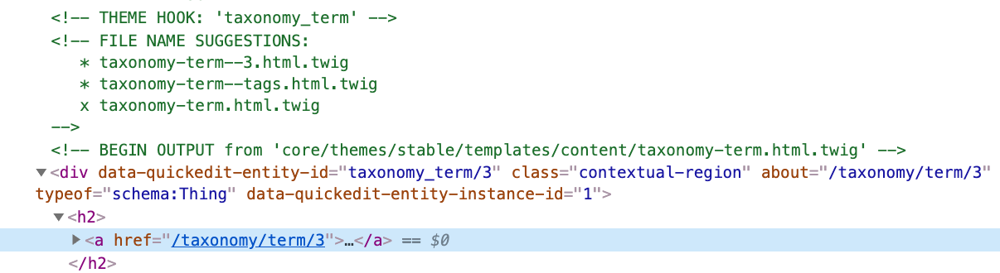
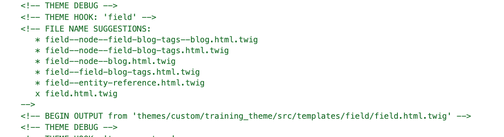

# Taxonomy terms

Taxonomy are Drupal entities just like Nodes, blocks, etc.  This means we can create view modes and custom templates so we can integrate them with Drupal.  Currently we don't have a component for displaying tags.  Let's quickly build one.

#### Build a component for the tags

1. Inside `src/patterns/components/` create a new folder called **tags**
2. Inside the _tags_ folder create a new file called `_tag-item.twig` \(_notice the underscore in the file name_\).  Using an underscore in-front of a twig file name allows [Pattern Lab to ignore the file](https://patternlab.io/docs/hiding-patterns-in-the-navigation/).  We don't need to see an individual tag in Pattern Lab, we need to see the full collection of tags.  More on this shortly.
3. Add the following code inside `_tag-item.twig`



```php

  <a href="{{ url }}" class="tag__link">
    {{ name }}
  </a>

```



1. Now inside the _tags_ folder create the following files with the following code:



```yaml
{
  "items": [
    {
      "name": "Frashion",
      "url": "#"
    },
    {
      "name": "Sports",
      "url": "#"
    },
    {
      "name": "Health",
      "url": "#"
    }
  ]
}
```





```php
{{ attach_library('training_theme/tags') }}

<ul class="tags"{{ attributes }}>
  {{ title_prefix }}
  {{ title_suffix }}
  
    
      <li class="tag__item">
        
      </li>
    
  
</ul>
```



* Notice we are including the single tag item while we look through the items array.



```css
// Import site utilities
@import '../../global/utils/init';

.tags {
  display: flex;
  list-style: none;
  margin: 0;
  padding: 0;
}

.tag__item {
  background-color: $color-catskill-white;
  border-radius: 99999px;
  color: $color-gray-dark;
  display: inline-block;
  margin-right: 10px;

  a {
    color: lighten($color-gray-dark, 25%);
    display: inline-block;
    font-size: 1.3rem;
    line-height: 1.2;
    padding: 2px 10px;
    text-decoration: none;

    &:hover,
    &:focus {
      color: $color-gray-dark;
    }
  }
}
```



* If you save your changes and compile your code you should see a list of tags in Pattern Lab.  Let's integrate this component with Drupal now to fix our tags inside the card of blog posts.

### Integrating the Tags component with Taxonomies

We will use the **Tags** Taxonomy vocabulary that comes out of the box with Drupal.

#### Creating a view mode for the tags vocabulary

1. Go to the **Tags** _Manage Display_ screen and create a new view mode for Tags called **Blog**.  Creating a view mode for tags will allow us to create a custom twig template that will only affect tags in blog posts.  Typically tags look the same across an entire website, but there are times when some tags may need to look different depending where they appear.
2. After the view mode has been created be sure to enable it in the Tags vocabulary.
3. Hide the label for the description inside the **Blog** view mode.

#### Update the Blog content type

Now let's make a quick change to the Tags field in the Blog content type so we can change the tag's format from Label to **Rendered entity**.

1. Go to the Blog content type's **Teaser** view mode
2. Change the Tags fields format to `Rendered entity` and hide its label if not already done.
3. Change the Tags fields view mode to **Blog** by clicking the little gear icon to the right of the Tags' field.
4. Be sure to click **Update** and then **Save**

#### Template suggestions for Taxonomy terms

If you recall when we built the Tags component above we did it in two steps, first we built a single tag item, then we built a list of tags by including the single item in a loop.  We will follow the same approach for integrating the component with Drupal.  We will create a twig template suggestion for a single link item, then we will create another one to wrap the entire list of tags.

1. Inspect the tags found in the homepage From our blog section \(right-click + Inspect\) 
2. Identify the twig template suggestions for taxonomy.



The first template suggestions above give us 3 options.  We are going to name our template `taxonomy-term--tags.html.twig`.  

1. Go ahead and copy the source template from its original location into your theme's `/templates/content` folder.  
2. Rename the copy of the template to match our desired name.  


Don't forget to clear Drupal's cache every time you add a new template to your theme.


The next template we need will be found just above the first one. The code looks like this:



As I mentioned before, we only want to affect tags that appear on blog posts.  Looking at the list of options for template suggestions I can see that `field--node--field-blog-tags--blog.html.twig` \(top one\), is the one that gives us the more specific target.  This template is for the Tags field in the blog content type and at the end it includes the view mode we just created for the Tags vocabulary, **blog**.

Go ahead and make a copy of this template from its original location into your theme's `/templates/field` folder, and rename it as we just discussed.

#### Time to integrate the tags

1. Open `taxonomy-term--tags.html.twig` and remove all the code except the comments
2. Add the following code at the bottom of the template:



```php

  

```



* We're leaving the `if` statement the template provided and are replacing its code with a twig `include` statement to nest the individual tag item we created in Pattern Lab.
* Then we are mapping the `name` and `url` properties with Drupal's equivalents.  If you look at the template's comments you will see this template already provides these two properties for us.

1. Open `field--node--field-blog-tags--blog.html.twig` and also remove all of the code except for the comments
2. Add the following code at the bottom of the template:



```php
<ul{{ attributes.addClass('tags')}}>
  
    <li{{ item.attributes.addClass('tag__item') }}>
      
        
          {{ item.content }}
        
      
    </li>
  
</ul>
```



* You should be ashamed of yourself for doing what you just did above 🤣
* If you've been paying attention in training you would remember that I mentioned before that a presenter template \(like the one above\), should not have any HTML/markup.  It should only provide the data for our component.  So why did we do this?  Well, it's not terribly bad.  We're still using all of Drupal's attributes, but I was having a hard time getting the integration to work cleanly.
* Ideally we should just be able to include or embed the `tags.twig` template and that's it.  But I couldn't figure it out.  I'm sure I can figure it out but I was already spending too much time on this and I figured this was not so bad 🙈.
* Your mission, should you choose to accept it, is to fix this at some point.  Not now though.
* After reloading the homepage the tags should now look like in our designs.  Great job! 🙌

