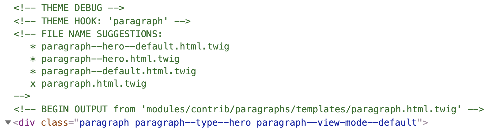
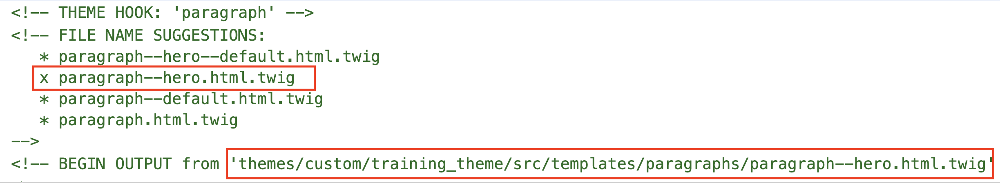

# Twig template suggestions

[Template suggestions](https://www.drupal.org/docs/8/theming/twig/working-with-twig-templates) are Twig templates used to override Drupal core or contrib modules templates. Template suggestions are saved in your theme's `/templates` directory. This is where Drupal knows to look for twig templates when rendering content. If it finds twig templates it uses those over the ones in core when rendering content.  Template suggestions are what we will use to integrate components with Drupal.  These template suggestions in the context of component integration, are typically referred to as **Presenter Templates** and as you will see, their only purpose is to pass data from Drupal to  the component.

#### Identifying template suggestions

If you have been using Drupal for a while you may be well familiar with where to get templates from or what to name them. However if you've never worked with template suggestion no worries, Twig debugging, which we enabled above, will help us identify the templates we need.

#### Do the following:

* In your Drupal site, create  a node where you can add a Hero, or visit a page that has a Hero
* Right-click anywhere on the hero and select **Inspect**  or **inspect element**, depending on your browser.  This will display the HMTL that makes up the page you are currently viewing.  In addition, it will display other information generated by Twig debugging.  See an example of Twig debug output below \(click on it to zoom in\):

## How template suggestions work 

If you look at the image above, you will see a few things that are extremely helpful for creating the right template suggestions.

* The last line of green text \(`BEGIN OUTPUT...`\) shows where the template being used by Drupal to render the Hero is located and what its name is \(`modules/contrib/paragraphs/templates/paragraph.html.twig`\).
* Just above that line, there is a list of files all of which begin with **paragraph**. Drupal is telling us we can create a Twig template with any of the names listed above and we can customize it to our needs.  This list is what we mean when we say _Template suggestions_.
* The file name with an **"x"** next to it is the template Drupal is currently using to render the Hero.

## Creating new template suggestions 


**IMPORTANT:** The first rule of Drupal is "**Don't hack core**".  This means you should never edit or modify a template used by Drupal in a global manner.  Instead, you create a copy of that template in your theme.  This is a best practice and we are going to follow it throughout this training.


Based on the Twig debugging code above we see Drupal is using a Paragraph template to render the Hero.  This is because we create a Paragraph type called Hero to use as the data entry form for any Hero. 

1. The last line of green text \(`BEGIN OUTPUT...`\) shows where the paragraph template being used is located \(`modules/contrib/paragraphs/templates/paragraph.html.twig`\)
2. Navigate to the path above and copy the `paragraph.html.twig` template then paste it inside your theme's `/themes/custom/<theme-name>/src/templates/paragraphs/` \(if this path does not exist in your theme, create it\)
3. Rename the newly copied template in your theme to `paragraph--hero.html.twig`.  Why this name?  Well, while we could had used any of the suggested names above, this name is the one that makes the most sense for our template suggestion.  Now every time the Hero component is rendered, Drupal will use this new template and not the one under the Paragraph's module.
4. Next let's clear Drupal's cache
5. Reload the page and inspect the code one more time.

Notice there is an **"x"** next to `paragraph--hero.html.twig`, which means Drupal is now using our custom twig template suggestion. Also notice the path of the template is now our own theme's template directory.


**TIP**: If I know I will be creating multiple template suggestions of the same kind \(i.e. paragraph\), I would normally leave the unchanged copy of `paragraph.html.twig` in my theme and make copies of it every time I need a new template. This way I don't have to copy the same template over and over again from Drupal core or a contrib module \(I'm lazy\).


Now that we have a good understanding on what is required to integrate a component with Drupal, and went over best practices, we are ready to integrate the [Hero component](../hero-component.md).

