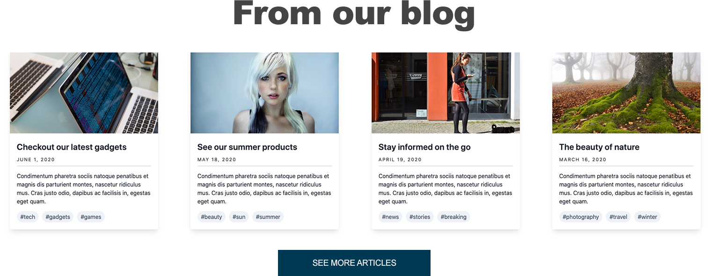

# From our blog

So far we've been building individual components and built them in a way we can re-use them. Well, the time has come to build a list of content where we will re-use most components we've built. This is where component-based shines. Using the designs below, we will build the **From our blog** content list. Here are some details about this component:

* It uses multiple instances of the card component
* The entire collection has a heading of "From our blog"
* It uses a bottom that links users to a page like `/blog`



### Exercise: Build the From our blog component

This component will be completely different than the ones we've built thus far. All previous components have been a single item, this one will have an unlimited number of items. Let's start

#### Component's stock content

1. Inside `src/patterns/components`create a new folder called **from-our-blog**
2. Inside the _from-our-blog_ folder create a new file called `from-our-blog.json`
3. Inside _from-our-blog.json_ add the following code:



```yaml
{
  "heading": {
    "heading_level": "2",
    "modifier": "heading--large",
    "title": "From our blog",
    "url": ""
  },
  "items": [
    {
      "image": "",
      "title": {
        "heading_level": "3",
        "modifier": "card__title",
        "title": "The beauty of nature",
        "url": "#"
      },
      "date": "March 16 2020",
      "body_text": "Curabitur blandit tempus porttitor. Vestibulum id ligula porta felis euismod semper. Vivamus sagittis lacus vel augue laoreet rutrum faucibus dolor auctor. Aenean lacinia bibendum nulla sed consectetur.",
      "tags": [
        {
          "text": "Phtography",
          "url": "#"
        },
        {
          "text": "Nature",
          "url": "#"
        },
        {
          "text": "Outdors",
          "url": "#"
        }
      ],
      "modifier": "from-our-blog__card"
    },
    {
      "image": "",
      "title": {
        "heading_level": "3",
        "modifier": "card__title",
        "title": "The beauty of nature",
        "url": "#"
      },
      "date": "March 16 2020",
      "body_text": "Curabitur blandit tempus porttitor. Vestibulum id ligula porta felis euismod semper. Vivamus sagittis lacus vel augue laoreet rutrum faucibus dolor auctor. Aenean lacinia bibendum nulla sed consectetur.",
      "tags": [
        {
          "text": "Phtography",
          "url": "#"
        },
        {
          "text": "Nature",
          "url": "#"
        },
        {
          "text": "Outdors",
          "url": "#"
        }
      ],
      "modifier": "from-our-blog__card"
    },
    {
      "image": "",
      "title": {
        "heading_level": "3",
        "modifier": "card__title",
        "title": "The beauty of nature",
        "url": "#"
      },
      "date": "March 16 2020",
      "body_text": "Curabitur blandit tempus porttitor. Vestibulum id ligula porta felis euismod semper. Vivamus sagittis lacus vel augue laoreet rutrum faucibus dolor auctor. Aenean lacinia bibendum nulla sed consectetur.",
      "tags": [
        {
          "text": "Phtography",
          "url": "#"
        },
        {
          "text": "Nature",
          "url": "#"
        },
        {
          "text": "Outdors",
          "url": "#"
        }
      ],
      "modifier": "from-our-blog__card"
    },
    {
      "image": "",
      "title": {
        "heading_level": "3",
        "modifier": "card__title",
        "title": "The beauty of nature",
        "url": "#"
      },
      "date": "March 16 2020",
      "body_text": "Curabitur blandit tempus porttitor. Vestibulum id ligula porta felis euismod semper. Vivamus sagittis lacus vel augue laoreet rutrum faucibus dolor auctor. Aenean lacinia bibendum nulla sed consectetur.",
      "tags": [
        {
          "text": "Phtography",
          "url": "#"
        },
        {
          "text": "Nature",
          "url": "#"
        },
        {
          "text": "Outdors",
          "url": "#"
        }
      ],
      "modifier": "from-our-blog__card"
    }
  ]
}
```



There is a lot going on in this file. Let's go over it and you will see that it's actually relatively straight forward.

* First we defined the `heading`  object which will be used as the title for the entire collection.
* At around line 8, we declared an `items` array.  This will help us mimic the array of content to build the collection.
* Each item in the items array represents a card.  Inside each card item we have defined the card's fields \(`image`, `title`, `body_text`, `cta` \).  We have repeated this 3 times to achieve the collection shown in the From our blog image above.

#### Component markup

So the data is ready, let's go ahead and add the markup for the component.

1. Inside the _from-our-blog_ folder create a new file called `from-our-blog.twig`
2. Inside _from-our-blog.twig_ add the following code:



```php
{{ attach_library('training_theme/from-our-blog') }}

<section class="from-our-blog{{ modifier ? ' ' ~ modifier }}{{- attributes ? attributes.class -}}"
  {{- attributes ? attributes|without(class) -}}>
  
    
  

  
    <div class="from-our-blog__items">
      
          
      
    </div>
  
</section>
```



As I mentioned earlier, this is a unique component and nothing like we've built thus far. Let's review:

* First we attach the component's library.  **Don't forget to create the library.**
* Next we add a `<section>` element to wrap the entire component.  As we've done before, the first and main component wrapper should always use the name of the component as its class \(`from-our-blog`\).  In addition we pass the `modifier` and `attributes` placeholders.
* Next we make use of the **heading** component to print the component's main title and we wrap it in an `if` statement to ensure we don't print an empty heading tag.
* Next we check if the `items` array exists, and if so, we create `<div>` to which we pass the class of `from-our-blog__items`.  Notice how the classes associated with these elements describe not only what the component they belong to, but also the relationship among the elements.
* **Now, for the first time** we use a `for loop` which is a way for Twig to iterate or loop through an array of content and capture every item in the array.  In this case each item is a card.  For every item we find in the array, we are going to include the Card component and map its fields accordingly.
* Finally, we close the `loop` and we close the `if` statement to complete the logic of the component.

#### Component's styles

We'll skip styles for now, but let's at least create a Sass file for when we need to write styles.

1. Inside the _hero_ folder create a new file called **from-our-blog.scss**
2. Inside `from-our-blog.scss` add this code:



```css
// Import site utilities
@import '../../global/utils/init';

.from-our-blog {
  @include component-spacing;
}

.from-our-blog__items {
  display: flex;
  justify-content: space-around;
}

.from-our-blog__card {
  flex: 0 0 22%;
  max-width: 400px;
}
```



The code above simply imports global utilities from our theme which will be needed as we start writing styles in Sass. More on this later.

## Compiling the code to generate the From our blog

While in your theme's root directory, run the following commands in your command line and press **Return**

`npm run build`

`npm run watch`


**TIP:** Since we created a whole new component; if you had the watch task running, it is recommended you stop it by pressing **Ctrl + C** on your keyboard and run the commands above. This will ensure the new component will be generated and all related code will be compiled.


In your browser of choice open the following URL: [http://localhost:3000](http://localhost:3000). You should be able to find the _From our blog_ component. The styles we wrote already account for responsive behavior of this component.

