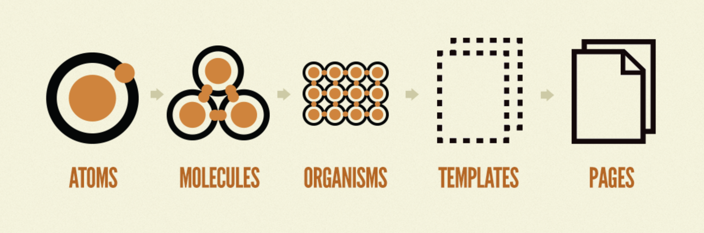

# Introduction to Atomic Design and Component-driven Development

Web development has gone through several paradign shifts since its birth but none has disrupted this industry more than Component-driven development. One reason is that when an organization or a team makes the decision to use this methodology and do it the right way, it's not only developers who have to learn a new way of doing things, this change affects everyone involved in the success of a project. Anyone from Product owners, Project managers, Designers, Developers, both front-end and back-end, and QA Engineers. All these roles need to be in sync about this methodology if the project or product is to be a success.

Although component-driven development has been around for a while, it wasn't until [Atomic Design](https://bradfrost.com/blog/post/atomic-web-design/) was first introduced back in 2013 that this methodology became a trending topic. The idea of building big and robust websites by breaking everything down into small pieces was quite the change from the traditional top-to-bottom approach we had been doing since the begining of the web.

With Atomic Design, [Brad Frost](https://bradfrost.com/about/){target=_blank rel=noopener} suggest that a website should be broken down in five categories:

1. **Atoms**: These are the smallest pieces you will use over and over such as a button, a title field, a label, an image, etc.
1. **Melecules**: These are bigger components that are built from a collection of Atoms. Like a site's logo or search area.
1. **Organisms**: These are even bigger components made up of multiple Molecules. Things like a site's header or footer.
1. **Templates**: These are like sections or regions of your websites which can contain multiple Organisms.
1. **Pages**: Pages are the ultimate goal which can be easily built by combining several components of any type and size.

In this training we will discuss the advantages of using component-driven development with the Atomic Design principles.
Although I am not a big fan of using the atomic design terminology (atorms, molecules, organisms, etc.), when organizing my components, for the sake of simplicity we will follow that terminology in this training.
